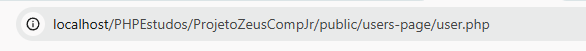

# ProjetoZeusCompJr
 <h2>Projeto de um site conectado a um Banco de Dados em MySQL utilizando PHP</h2>
 
 
- Teste de Sistema backend de Banco de Dados para <strong>Gerenciar Funcionários e orçamentos</strong> de uma <strong>Empresa</strong>

 
- <strong>FrontEnd</strong>: <strong>HTML5</strong> com as <strong>CSS</strong> + <strong>JavaScript</strong>

 
 <h3>📟 API </h3>
 
- <em>Ainda em produção</em>

 

    - Inicialmente, projetada utilizando <strong>PHP</strong> para conectar o <strong>Banco de Dados</strong>(BackEnd) com o <strong>HTML</strong>(FrontEnd)
 

 
- Gerenciar Funcionários, Orçamentos e Estoques

 

 <ol>
    <li>👤 <strong>Funcionários</strong></li>
    
- Mostrar na tela 
        <ul>
            <li><strong>Total de Funcionários</strong></li>
            <li><strong>Todos os Funcionários Cadastrados</strong></li>
            <li><strong>Realizar Buscas</strong> por nome</li>
            <li><strong>Filtra</strong> por Área de Atuação ou Cargo (ainda em produção)</li>
        </ul>
    

     <ul>
         <li>Nome</li>
         <li>Data de Nascimento</li>
         <li>Email</li>
         <li>Número de Telefone</li>
         <li>Gênero</li>
         <li>Data de Ingresso</li>
         <li>Cargo</li>
         <li>Área</li>
     </ul>
     <li>💰 <strong>Orçamentos</strong></li>
     
- Mostra na tela
        <ul>
            <li><strong>Total de Orçamentos</strong></li>
            <li><strong>Todos os Orçamentos Cadastrados</strong></li>
            <li><strong>Realizar Buscas</strong> por Número do Orçamento</li>
            <li><strong>Filtra</strong> por Valor Estimado(crescente) e por Custo Previsto(crescente)(ainda em produção)</li>
        </ul>
     

     <ul>
         <li>Número do Orçamento</li>
         <li>Descrição</li>
         <li>Valor Estimado</li>
         <li>Custos Previstos</li>
         <li>Cliente Relacionado</li>
     </ul>
     <li>📝 <strong>Estoques</strong>(Em Desenvolvimento) </li>
 </ol>

 

 
🌑 Possui suporte para <strong>Modo Escuro</strong> 

 
🗺️ Navegação entre as sessões (user-page) utilizando <strong>JavaScript</strong> 

 <h3>📂 Esquema de Pastas</h3>
    <pre>
        |
        |-- public (Interface Visual)
        |   |-- general-images (imagens utilizadas em todas as páginas)
        |   |-- icon (ícone/favicon das páginas)
        |   |-- login-page (página de login)
        |   |-- sign-up-page (página de cadastro)
        |   |-- users-page (página do usuário já logado)
        |   |-- dark-mode.css (estilos do Modo Escuro)
        |   |-- dark-mode.js (scripts do Modo Escuro)
        |   |-- general-style.js (estilos utilizados em todas as páginas)
        |
        |-- dbConnection.php (Conectar o Banco de Dados com o FrontEnd)
        |
        |-- DumpEmpresaPZ.sql (Cópia do Banco de Dados)
    </pre>

<h3>🖥️ Rodar o projeto</h3>
<ol>
    <li>Baixe o XAMPP <a href="https://www.youtube.com/watch?v=0Y9OZ0vc1SU&t=213s">link</a></li>
    <li>Ative os módulos <strong>Apache</strong> e <strong>MySQL</strong></li>
    <li>Baixe o <a href="https://www.youtube.com/watch?v=a5ul8o76Hqw&t=13s">MySQLWorkBench</a></li>
    <li>Clone o Banco de Dados que está na pasta do repositório(Dump)</li>
    <li>
        Adicione o Banco de Dados ao seu Servidor Local clicando no símbolo demonstrado abaixo   </img>
    </li>
    <li>Adicione a Pasta do projeto a pasta "htdocs" dentro de xampp (C:\xampp\htdocs)</li>
    <li>
        Digite no Navegador "localhost/'pasta'/ProjetoZeusCompJr/public/users-page/user.php"</img>
          Ou
          
        Digite no Navegador "localhost/'pasta'/ProjetoZeusCompJr/public/" e navegue pela pasta que quiser
    </li>
</ol>

<h3>📋 Para fazer: </h3>
<ul>
    <li>Página de Estoques</li>
    <li>Página de Notificações</li>
    <li>✅ Permitir acesso completo ao site apenas para usuários logados </li>
    <li>✅ Linkar página de login com página do usuário já logado</li>
    <li>✅ Linkar página de cadastrar novo usuário com o Banco de Dados</li>
    <li>Mandar código de recuperação de senha pelo email</li>
    <li>Segurança de Senhas</li>
</ul>
